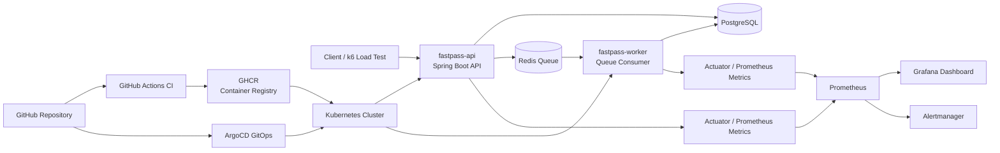
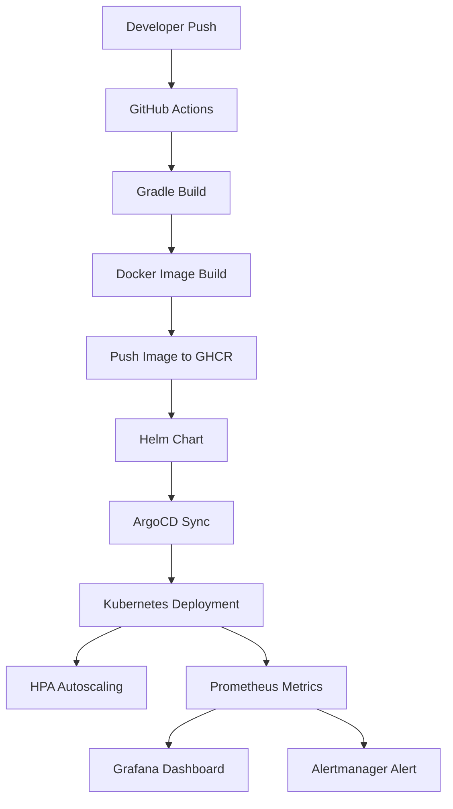

# FastPass

FastPass는 선착순 이벤트 신청 상황을 가정한 Kubernetes 기반 서비스 운영 자동화 프로젝트입니다.

짧은 시간에 트래픽이 집중되는 상황에서 API 서버, Redis Queue, Worker, Kubernetes 배포, 부하 테스트, 오토스케일링, 모니터링, 알림, GitOps, CI/CD 흐름을 단계적으로 검증하는 것을 목표로 합니다.

---

## Project Goal

FastPass의 목표는 단순한 API 구현이 아니라, 운영 환경에서 발생할 수 있는 트래픽 증가, Queue 적체, Worker 확장, 장애 탐지, 배포 자동화 시나리오를 Kubernetes 기반으로 검증하는 것입니다.

주요 목표는 다음과 같습니다.

- Redis Queue 기반 비동기 신청 처리
- API 서버와 Worker 역할 분리
- Kubernetes 기반 배포
- k6 기반 부하 테스트
- HPA 기반 자동 확장 검증
- Prometheus/Grafana 기반 모니터링
- Alertmanager 기반 장애 알림
- Helm Chart 기반 배포 표준화
- ArgoCD 기반 GitOps 배포
- GitHub Actions 기반 CI 구성
- GHCR 기반 container image 배포

---

## Core Scenario

1. 사용자가 이벤트에 신청한다.
2. API 서버는 신청 요청을 `PENDING` 상태로 저장한다.
3. 신청 ID는 Redis Queue에 적재된다.
4. Worker가 Queue를 소비하며 신청을 처리한다.
5. 정원이 남아 있으면 `SUCCESS`, 초과되면 `FAILED`로 상태를 변경한다.
6. 트래픽이 증가하면 Kubernetes HPA가 API/Worker Pod를 자동 확장한다.
7. Prometheus와 Grafana를 통해 API, Worker, Queue, JVM, DB metric을 관측한다.
8. Queue backlog 또는 Worker 처리 실패가 발생하면 Alertmanager로 알림을 확인한다.
9. GitHub Actions가 build와 container image push를 수행한다.
10. ArgoCD가 Git에 정의된 Helm Chart를 Kubernetes에 동기화한다.

---

## Architecture



API와 Worker는 동일한 Spring Boot image를 사용하지만, Kubernetes Deployment를 분리하여 독립적으로 확장할 수 있도록 구성했습니다.

| Deployment | Role |
|---|---|
| `fastpass-api` | HTTP API 요청 처리 |
| `fastpass-worker` | Redis Queue 소비 및 신청 처리 |
| `postgres` | 이벤트 및 신청 데이터 저장 |
| `redis` | 신청 Queue 저장 |

---

## DevOps Flow

현재 FastPass의 전체 흐름은 다음과 같습니다.



이를 통해 코드 변경부터 container image 생성, GitOps 배포, 운영 관측, 알림까지 이어지는 DevOps 흐름을 검증했습니다.

---

## Tech Stack

### Application

- Java 21
- Spring Boot
- Spring Data JPA
- Spring Validation
- Spring Actuator
- Micrometer
- PostgreSQL
- Redis

### Container & Local Environment

- Docker
- Docker Compose
- GHCR

### Kubernetes

- Kubernetes
- Deployment
- Service
- ConfigMap
- Secret
- PVC
- HPA
- metrics-server
- Readiness Probe
- Liveness Probe

### Load Test

- k6

### Observability

- Prometheus
- Grafana
- ServiceMonitor
- PrometheusRule
- Alertmanager
- Custom Metrics

### GitOps & CI/CD

- Helm
- ArgoCD
- GitHub Actions
- GitHub Container Registry

---

## Features

- 이벤트 생성 API
- 이벤트 목록 조회 API
- 이벤트 단건 조회 API
- 이벤트 신청 API
- 신청 상태 조회 API
- 중복 신청 방지
- 정원 초과 처리
- Redis Queue 기반 비동기 처리
- Worker batch processing
- API/Worker Deployment 분리
- Worker replica 증가에 따른 처리량 개선 검증
- k6 기반 부하 테스트
- HPA 기반 API/Worker 자동 확장 검증
- Prometheus custom metric 노출
- Grafana dashboard 구성
- Alertmanager 기반 알림 검증
- Helm Chart 기반 배포
- ArgoCD GitOps 배포
- GitHub Actions CI
- GHCR image push
- GHCR image 기반 Kubernetes 배포

---

## API Endpoints

| Method | Endpoint | Description |
|---|---|---|
| `POST` | `/api/events` | 이벤트 생성 |
| `GET` | `/api/events` | 이벤트 목록 조회 |
| `GET` | `/api/events/{eventId}` | 이벤트 단건 조회 |
| `POST` | `/api/events/{eventId}/apply` | 이벤트 신청 |
| `GET` | `/api/applications/{applicationId}` | 신청 상태 조회 |
| `GET` | `/api/queue/applications/size` | Redis Queue 크기 조회 |
| `GET` | `/actuator/health` | Spring Boot health check |
| `GET` | `/actuator/prometheus` | Prometheus metric endpoint |

---

## Custom Metrics

FastPass는 운영 관측을 위해 다음 custom metric을 제공합니다.

| Metric | Type | Description |
|---|---|---|
| `fastpass_queue_size` | Gauge | 현재 Redis Queue 크기 |
| `fastpass_worker_processed_total` | Counter | Worker가 처리한 신청 수 |
| `fastpass_worker_processing_failed_total` | Counter | Worker 처리 실패 수 |

Grafana와 Prometheus에서는 다음과 같은 관점으로 관측했습니다.

- API request rate
- API response time
- Pod CPU usage
- JVM memory usage
- DB active connections
- Redis Queue size
- Worker processed count
- Worker processing rate
- Worker failure count

---

## Validation Summary

### 1. API MVP

이벤트 생성, 이벤트 조회, 이벤트 신청, 신청 상태 조회 API를 구현했습니다.

중복 신청 방지와 정원 초과 처리를 통해 선착순 이벤트 신청 서비스의 기본 흐름을 검증했습니다.

### 2. Redis Queue Processing

신청 요청을 Redis Queue에 적재하고, Worker가 비동기적으로 처리하는 구조를 구현했습니다.

이를 통해 API 서버는 요청 수신에 집중하고, Worker는 Queue 처리에 집중하도록 역할을 분리했습니다.

### 3. Worker Batch Processing

Worker가 Queue에서 applicationId를 하나씩 처리하던 구조를 개선하여 batch 단위로 처리하도록 변경했습니다.

이를 통해 동일한 부하 조건에서 Queue backlog가 감소하는 것을 확인했습니다.

### 4. API / Worker Split

API와 Worker를 별도 Kubernetes Deployment로 분리했습니다.

이를 통해 HTTP 요청 처리 Pod와 Queue 처리 Pod를 독립적으로 scale-out할 수 있도록 구성했습니다.

### 5. Worker Scaling

Worker replica 수를 증가시켰을 때 Queue 처리 성능이 개선되는 것을 검증했습니다.

Worker 1개와 2개를 비교했을 때, Worker replica 증가에 따라 Queue backlog가 더 빠르게 감소하는 것을 확인했습니다.

### 6. HPA Autoscaling

API와 Worker에 Kubernetes HPA를 적용하고, k6 부하 테스트를 통해 자동 확장 동작을 검증했습니다.

부하 발생 시 API와 Worker가 각각 1 replica에서 최대 3 replicas까지 scale-out 되는 것을 확인했습니다.

### 7. Monitoring

Prometheus와 Grafana를 구성하고 FastPass API/Worker metric을 수집했습니다.

Actuator metric뿐만 아니라 FastPass custom metric을 추가하여 Queue size와 Worker 처리량을 관측했습니다.

### 8. Alerting

PrometheusRule과 Alertmanager를 구성하여 Queue backlog와 Worker 처리 실패 상황에 대한 alert을 검증했습니다.

Redis Queue에 잘못된 applicationId를 주입하여 Worker failure alert이 발생하는 것을 확인했습니다.

### 9. Helm

raw Kubernetes YAML을 Helm Chart로 전환했습니다.

namespace, image, resource, HPA, monitoring, alerting 설정을 values.yaml로 관리할 수 있도록 구성했습니다.

### 10. ArgoCD GitOps

ArgoCD Application을 구성하여 GitHub repository의 Helm Chart를 Kubernetes에 동기화했습니다.

ConfigMap을 수동으로 변경한 뒤 ArgoCD self-heal을 통해 Git desired state로 복구되는 것을 확인했습니다.

### 11. GitHub Actions CI

main branch push와 pull request 시 GitHub Actions가 자동으로 실행되도록 구성했습니다.

Gradle build와 Docker image build를 자동 검증했습니다.

### 12. GHCR Image Push

GitHub Actions에서 Docker image를 build한 뒤 GHCR에 push하도록 구성했습니다.

`latest` tag와 commit SHA tag를 함께 생성하여 image 추적성을 확보했습니다.

### 13. GHCR Image Deployment

Helm Chart의 image 설정을 GHCR 기준으로 변경했습니다.

ArgoCD Sync를 통해 Kubernetes가 `ghcr.io/kdh8128/fastpass-k8s-api:latest` image를 사용하여 API와 Worker Pod를 실행하는 것을 확인했습니다.

---

## Documentation

세부 구현 및 검증 과정은 `docs/` 디렉터리에 정리했습니다.

| Document | Description |
|---|---|
| `docs/00-project-overview.md` | 프로젝트 개요 |
| `docs/01-api-mvp.md` | API MVP 구현 |
| `docs/02-redis-queue.md` | Redis Queue 처리 구조 |
| `docs/03-docker-compose.md` | Docker Compose 검증 |
| `docs/04-kubernetes-local.md` | Kubernetes 로컬 배포 |
| `docs/05-load-test.md` | k6 부하 테스트 |
| `docs/06-worker-batch-improvement.md` | Worker batch 처리 개선 |
| `docs/07-api-worker-split.md` | API/Worker 분리 |
| `docs/08-worker-scaling-test.md` | Worker scaling 검증 |
| `docs/09-hpa-autoscaling.md` | HPA 자동 확장 검증 |
| `docs/10-prometheus-grafana-monitoring.md` | Prometheus/Grafana 모니터링 |
| `docs/11-custom-metrics.md` | FastPass custom metric |
| `docs/12-alerting.md` | PrometheusRule/Alertmanager 알림 |
| `docs/13-helm.md` | Helm Chart 구성 |
| `docs/14-argocd-gitops.md` | ArgoCD GitOps 배포 |
| `docs/15-github-actions-ci.md` | GitHub Actions CI |
| `docs/16-container-registry-ghcr.md` | GHCR image push |
| `docs/17-ghcr-argocd-deployment.md` | GHCR image 기반 ArgoCD 배포 |

---

## Troubleshooting Highlights

프로젝트 진행 중 다음 문제를 해결했습니다.

| Issue | Cause | Resolution |
|---|---|---|
| Kubernetes `ErrImageNeverPull` | 로컬 Kubernetes node에 image가 없음 | Docker image를 node에 import |
| HPA metric `<unknown>` | CPU request 미설정 | Deployment resource request 추가 |
| Spring Boot Pod 재시작 | livenessProbe가 너무 이른 시점에 동작 | readiness/liveness endpoint 분리 및 delay 조정 |
| ArgoCD OutOfSync | HPA가 Deployment replicas 변경 | ArgoCD `ignoreDifferences`로 `/spec/replicas` 제외 |
| Worker failure metric 증가 | Redis Queue에 DB에 없는 applicationId 존재 | 실패 metric과 alert으로 감지 |
| GitHub Actions warning | deprecated action version 사용 | checkout/setup-java/setup-gradle action version 업데이트 |

---

## Current Status

현재 FastPass는 다음 구조까지 구현 및 검증되었습니다.

```text
Spring Boot API
Redis Queue Worker
PostgreSQL
Docker Compose
Kubernetes
HPA
k6 Load Test
Prometheus
Grafana
Alertmanager
Helm
ArgoCD
GitHub Actions
GHCR
```

Kubernetes 배포는 GHCR image를 사용합니다.

```text
ghcr.io/kdh8128/fastpass-k8s-api:latest
```

---

## Limitations

현재 프로젝트는 로컬 Kubernetes 환경에서 운영 시나리오를 검증한 단계입니다.

아직 다음 기능은 구현하지 않았습니다.

- Queue length 기반 Worker autoscaling
- KEDA 기반 autoscaling
- ArgoCD Image Updater
- commit SHA tag 기반 자동 배포
- Helm values image tag 자동 업데이트
- Loki 기반 로그 수집
- Trivy 기반 image vulnerability scan
- branch protection rule
- pull request merge condition
- 장애 대응 Runbook 자동화
- LLM 기반 로그 분석 및 장애 원인 요약

---

## Next Steps

향후 확장 방향은 다음과 같습니다.

- Queue backlog 기반 Worker autoscaling
- KEDA 또는 Prometheus metric 기반 autoscaling
- Loki 기반 로그 수집
- Trivy 기반 image scan
- ArgoCD Image Updater 도입
- commit SHA tag 기반 배포 고정
- 장애 대응 Runbook 정리
- LLM 기반 로그 분석 및 운영 자동화 실험
- README architecture diagram 추가
- 포트폴리오용 프로젝트 설명 정리

---

## Project Direction

FastPass는 단순 API 구현 프로젝트가 아니라, Kubernetes 환경에서 트래픽 급증, Queue 적체, Pod 확장, 장애 탐지, GitOps 배포, CI/CD 흐름을 검증하는 DevOps/Cloud 포트폴리오 프로젝트입니다.

특히 다음 운영 시나리오를 중심으로 구성했습니다.

```text
대량 신청 요청
→ Queue 적체 발생
→ Worker 처리량 관측
→ Pod autoscaling
→ Metric 수집
→ Alert 발생
→ GitOps 기반 배포 상태 복구
```

향후에는 Observability, 로그 분석, 장애 대응 Runbook, LLM 기반 운영 자동화 방향으로 확장할 수 있습니다.

---

## License

This project is licensed under the MIT License.