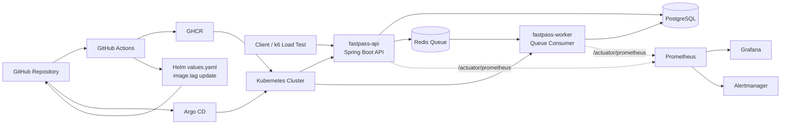

# FastPass-k8s

FastPass-k8s는 **선착순 이벤트 신청 상황**을 가정해 API, Redis Queue, Worker, Kubernetes 배포, 모니터링, 부하 테스트, CI/CD, GitOps 흐름을 검증한 DevOps/Kubernetes 포트폴리오 프로젝트입니다.

단순한 백엔드 API 구현보다, **트래픽 집중 상황에서의 Queue 처리, Pod 확장, 배포 자동화, 운영 지표 관측, 장애 알림**을 Kubernetes 환경에서 재현하고 검증하는 데 초점을 두었습니다.

---

## 1. Project Goal

- Redis Queue 기반 비동기 신청 처리 구조 구현
- API 서버와 Worker 역할 분리
- Kubernetes 기반 배포 구조 구성
- HPA 기반 API/Worker 수평 확장 검증
- Prometheus/Grafana 기반 운영 지표 수집
- PrometheusRule/Alertmanager 기반 알림 조건 정의
- Helm Chart 기반 배포 표준화
- Argo CD 기반 GitOps 배포 구성
- GitHub Actions, GHCR 기반 CI/CD 자동화 구성
- k6 기반 부하 테스트 및 운영 검증

---

## 2. Core Scenario

1. 사용자가 이벤트에 신청한다.
2. API 서버는 신청 요청을 `PENDING` 상태로 저장한다.
3. 신청 ID를 Redis Queue에 적재한다.
4. Worker가 Queue를 소비해 신청을 처리한다.
5. 정원이 남아 있으면 `SUCCESS`, 초과되면 `FAILED`로 상태를 갱신한다.
6. 부하가 증가하면 HPA가 API/Worker Pod를 확장한다.
7. Prometheus와 Grafana로 API, Worker, Queue, JVM, DB 지표를 관측한다.
8. Queue backlog 또는 Worker 처리 실패 상황은 Alertmanager 알림 조건으로 관리한다.
9. GitHub Actions가 이미지를 빌드하고 GHCR에 Push한다.
10. Argo CD가 Git의 Helm Chart 변경을 감지해 Kubernetes에 동기화한다.

---

## 3. Architecture



API와 Worker는 동일한 Spring Boot image를 사용하지만, Kubernetes Deployment를 분리해 독립적으로 확장할 수 있도록 구성했습니다.

| Resource | Role |
|---|---|
| `fastpass-api` | HTTP API 요청 처리 |
| `fastpass-worker` | Redis Queue 소비 및 신청 처리 |
| `postgres` | 이벤트 및 신청 데이터 저장 |
| `redis` | 신청 Queue 저장 |

---

## 4. CI/CD & GitOps Flow

```mermaid
flowchart LR
    PR[Pull Request] -.-> CI[Build/Test 검증]

    Push[main branch Push] --> Actions[GitHub Actions]
    Actions --> Build[Spring Boot Build]
    Build --> Docker[Docker Image Build]
    Docker --> GHCR[GHCR Push\nlatest + commit SHA]
    GHCR --> Values[Helm values.yaml\nimage.tag = commit SHA]
    Values --> Commit[Auto Commit\n[skip ci]]
    Commit --> Argo[Argo CD Sync]
    Argo --> Deploy[Kubernetes Rolling Update\nfastpass-api / fastpass-worker]
```

### 배포 흐름

- Pull Request에서는 빌드와 Docker 이미지 생성 가능 여부를 검증합니다.
- `main` 브랜치 Push 시 GitHub Actions가 Spring Boot 빌드와 Docker 이미지 빌드를 수행합니다.
- 이미지는 GHCR에 `latest` 및 commit SHA 태그로 Push됩니다.
- 동일 workflow에서 `deploy/helm/fastpass/values.yaml`의 `image.tag`를 최신 commit SHA로 자동 갱신합니다.
- GitHub Actions bot이 변경된 values.yaml을 `[skip ci]` 메시지로 Commit/Push하여 CI 반복 실행을 방지합니다.
- Argo CD가 Helm Chart 변경을 감지하고 `fastpass-gitops` 네임스페이스에 자동 동기화합니다.

---

## 5. Tech Stack

### Application

- Java 21
- Spring Boot
- Spring Data JPA
- Spring Validation
- Spring Actuator
- Micrometer
- PostgreSQL
- Redis

### Container / Kubernetes

- Docker
- Docker Compose
- Kubernetes
- Deployment / Service
- ConfigMap / Secret
- PVC
- HPA
- Readiness / Liveness Probe
- metrics-server

### Observability / Test

- Prometheus
- Grafana
- ServiceMonitor
- PrometheusRule
- Alertmanager
- k6

### GitOps / CI-CD

- Helm
- Argo CD
- GitHub Actions
- GHCR

---

## 6. Features

- 이벤트 생성, 목록 조회, 단건 조회 API
- 이벤트 신청 및 신청 상태 조회 API
- 중복 신청 방지
- 정원 초과 처리
- Redis Queue 기반 비동기 신청 처리
- API/Worker Deployment 분리
- Worker batch processing
- HPA 기반 API/Worker 자동 확장
- Prometheus custom metric 노출
- Grafana dashboard 구성
- PrometheusRule/Alertmanager 알림 조건 정의
- Helm Chart 기반 배포
- Argo CD GitOps 배포
- GitHub Actions 기반 CI/CD 자동화
- GHCR image 기반 Kubernetes 배포

---

## 7. API Endpoints

| Method | Endpoint | Description |
|---|---|---|
| `POST` | `/api/events` | 이벤트 생성 |
| `GET` | `/api/events` | 이벤트 목록 조회 |
| `GET` | `/api/events/{eventId}` | 이벤트 단건 조회 |
| `POST` | `/api/events/{eventId}/apply` | 이벤트 신청 |
| `GET` | `/api/applications/{applicationId}` | 신청 상태 조회 |
| `GET` | `/api/queue/applications/size` | Redis Queue 크기 조회 |
| `GET` | `/actuator/health` | Health check |
| `GET` | `/actuator/prometheus` | Prometheus metric endpoint |

---

## 8. Custom Metrics

| Metric | Type | Description |
|---|---|---|
| `fastpass_queue_size` | Gauge | 현재 Redis Queue 크기 |
| `fastpass_worker_processed_total` | Counter | Worker가 처리한 신청 수 |
| `fastpass_worker_processing_failed_total` | Counter | Worker 처리 실패 수 |

Grafana에서는 다음 지표를 중심으로 운영 상태를 확인했습니다.

- API request rate
- API response time
- Pod CPU usage
- JVM memory usage
- DB active connections
- Redis Queue size
- Worker processed count
- Worker processing rate
- Worker failure count

---

## 9. Validation Summary

### API / Queue / Worker

- 이벤트 생성, 신청, 상태 조회 API를 구현했습니다.
- API는 신청 요청을 Queue에 적재하고, Worker는 Redis Queue를 소비해 DB 상태를 갱신하도록 분리했습니다.
- Worker batch 처리와 Worker replica 증가에 따른 Queue backlog 감소를 검증했습니다.

### Kubernetes / HPA

- API, Worker, PostgreSQL, Redis를 Kubernetes 리소스로 구성했습니다.
- Readiness/Liveness Probe와 Resource request를 설정했습니다.
- HPA를 적용해 API/Worker가 부하 상황에 따라 최대 3 replicas까지 확장되는 것을 확인했습니다.

### Monitoring / Alerting

- ServiceMonitor를 통해 API/Worker의 `/actuator/prometheus` 지표를 Prometheus에 수집했습니다.
- Grafana에서 Queue size, Worker 처리량, Worker 실패 지표를 확인했습니다.
- PrometheusRule로 Queue backlog와 Worker 처리 실패 상황을 알림 조건으로 정의했습니다.

### Load Test

- k6로 20 VUs, 30초간 신청 API 부하를 발생시켰습니다.
- 요청 실패율 0%, p95 응답시간 403ms를 확인했습니다.
- 부하 상황에서 Queue가 일시적으로 증가한 뒤 Worker 처리로 감소하고, Worker 실패 누적은 0으로 유지되는 것을 확인했습니다.

### CI/CD / GitOps

- GitHub Actions workflow를 통해 Gradle build, Docker image build, GHCR push를 자동화했습니다.
- GHCR image는 `latest`와 commit SHA 태그를 함께 생성했습니다.
- Helm values.yaml의 `image.tag`를 commit SHA로 자동 갱신하고, `[skip ci]`로 CI 반복 실행을 방지했습니다.
- Argo CD가 Git 변경을 감지해 Kubernetes에 자동 재배포하는 흐름을 검증했습니다.

---

## 10. Quick Start

### Local dependency 실행

```bash
docker compose up -d postgres redis
```

### API 로컬 실행

```bash
cd apps/api
./gradlew.bat bootRun --args='--spring.profiles.active=local'
```

### Kubernetes 배포 확인

```bash
kubectl get pods -n fastpass-gitops
kubectl get svc -n fastpass-gitops
kubectl get hpa -n fastpass-gitops
```

### API 포트포워딩

```bash
kubectl port-forward -n fastpass-gitops service/fastpass-api 18083:8080
```

접속 경로는 다음과 같습니다.

- User page: `http://localhost:18083/`
- Admin page: `http://localhost:18083/admin/`
- Health check: `http://localhost:18083/actuator/health`

### Grafana 접속

```bash
kubectl port-forward -n monitoring svc/prometheus-stack-grafana 13000:80
```

```text
http://localhost:13000
```

### k6 부하 테스트

```bash
docker run --rm -i \
  -e BASE_URL=http://host.docker.internal:18083 \
  grafana/k6 run - < load-test/k6/apply-queue-test.js
```

---

## 11. Documentation

세부 구현 및 검증 과정은 `docs/` 디렉터리에 정리했습니다.

| Document | Description |
|---|---|
| `docs/00-project-overview.md` | 프로젝트 개요 |
| `docs/01-api-mvp.md` | API MVP 구현 |
| `docs/02-redis-queue.md` | Redis Queue 처리 구조 |
| `docs/03-docker-compose.md` | Docker Compose 검증 |
| `docs/04-kubernetes-local.md` | Kubernetes 로컬 배포 |
| `docs/05-load-test.md` | k6 부하 테스트 |
| `docs/06-worker-batch-improvement.md` | Worker batch 처리 개선 |
| `docs/07-api-worker-split.md` | API/Worker 분리 |
| `docs/08-worker-scaling-test.md` | Worker scaling 검증 |
| `docs/09-hpa-autoscaling.md` | HPA 자동 확장 검증 |
| `docs/10-prometheus-grafana-monitoring.md` | Prometheus/Grafana 모니터링 |
| `docs/11-custom-metrics.md` | FastPass custom metric |
| `docs/12-alerting.md` | PrometheusRule/Alertmanager 알림 |
| `docs/13-helm.md` | Helm Chart 구성 |
| `docs/14-argocd-gitops.md` | Argo CD GitOps 배포 |
| `docs/15-github-actions-ci.md` | GitHub Actions CI |
| `docs/16-container-registry-ghcr.md` | GHCR image push |
| `docs/17-ghcr-argocd-deployment.md` | GHCR image 기반 Argo CD 배포 |
| `docs/18-cicd-automation.md` | commit SHA 기반 CI/CD 자동화 |
| `docs/19-simple-frontend.md` | 사용자/관리자 페이지 구성 |

---

## 12. Troubleshooting Highlights

| Issue | Cause | Resolution |
|---|---|---|
| `ErrImageNeverPull` | 로컬 Kubernetes node에 image가 없음 | GHCR image 기반 배포로 전환 |
| HPA metric `<unknown>` | CPU request 또는 metrics 수집 문제 | Resource request와 metrics-server 상태 확인 |
| Pod 재시작 | livenessProbe가 너무 이른 시점에 동작 | readiness/liveness endpoint 분리 및 delay 조정 |
| Argo CD OutOfSync | HPA가 Deployment replicas 변경 | replicas 차이를 GitOps 관리 대상에서 분리 |
| Worker failure metric 증가 | Queue에 DB에 없는 applicationId 존재 | 실패 metric과 alert 조건으로 감지 |
| GitHub Actions 변경 미반영 | 실제 workflow 파일이 `ci.yaml`인데 다른 파일 수정 | 실제 사용 중인 workflow 파일 기준으로 수정 |
| Admin static resource 반영 문제 | Basic Auth, browser cache, Spring static resource 혼재 | curl, 새 파일명, inline style로 원인 분리 |

---

## 13. Current Status

현재 FastPass-k8s는 다음 구조까지 구현 및 검증되었습니다.

```text
Spring Boot API
Redis Queue Worker
PostgreSQL
Docker Compose
Kubernetes
HPA
k6 Load Test
Prometheus / Grafana
PrometheusRule / Alertmanager
Helm
Argo CD
GitHub Actions
GHCR
```

최종 배포 image는 GHCR 기반 commit SHA tag를 사용합니다.

```text
ghcr.io/kdh8128/fastpass-k8s-api:<commit-sha>
```

---

## 14. Limitations

현재 프로젝트는 로컬 Kubernetes 환경에서 운영 시나리오를 검증한 단계입니다.

아직 다음 기능은 구현하지 않았습니다.

- Queue length 기반 Worker autoscaling
- KEDA 기반 autoscaling
- Argo CD Image Updater
- Loki 기반 로그 수집
- Trivy 기반 image vulnerability scan
- branch protection rule
- pull request merge condition
- dev/staging/prod 환경 분리
- 장애 대응 Runbook 자동화
- LLM 기반 로그 분석 및 장애 원인 요약

---

## 15. Next Steps

- Queue backlog 기반 Worker autoscaling 적용
- KEDA 또는 Prometheus custom metric 기반 autoscaling 검토
- Loki 기반 로그 수집 구성
- Trivy 기반 container image scan 추가
- Argo CD Image Updater 도입 검토
- dev/staging/prod 환경 분리
- 장애 대응 Runbook 정리
- LLM 기반 로그 분석 및 운영 자동화 실험

---

## 16. Project Direction

FastPass-k8s는 단순 API 구현 프로젝트가 아니라, Kubernetes 환경에서 **트래픽 급증, Queue 적체, Pod 확장, 장애 탐지, GitOps 배포, CI/CD 자동화**를 검증하는 DevOps/Cloud 포트폴리오 프로젝트입니다.

핵심 운영 시나리오는 다음과 같습니다.

```text
대량 신청 요청
→ Queue 적체 발생
→ Worker 처리량 관측
→ Pod autoscaling
→ Metric 수집
→ Alert 조건 확인
→ GitOps 기반 배포 상태 복구
```

---

## License

This project is licensed under the MIT License.
