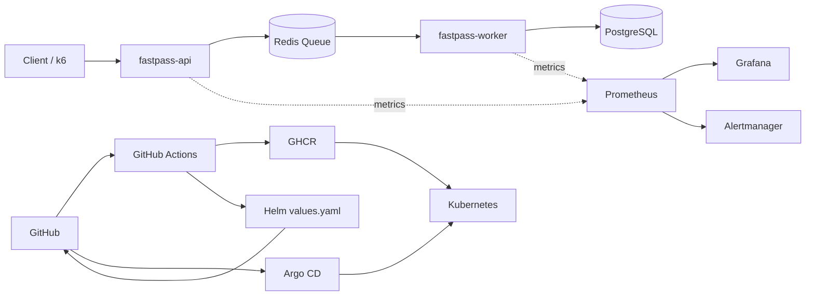
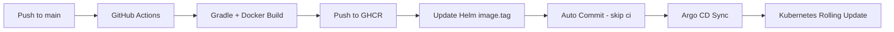

# FastPass-k8s

> A DevOps/Kubernetes portfolio project focused on asynchronous request processing, autoscaling, observability, CI/CD, and GitOps for a first-come, first-served event service.

## Overview

FastPass-k8s simulates a high-traffic event application where incoming requests are queued and processed asynchronously.

The project focuses on the **operational lifecycle of a Kubernetes service** rather than application features:

- API / Worker workload separation
- Redis Queue-based asynchronous processing
- Kubernetes deployment and HPA
- Prometheus/Grafana monitoring and alerting
- k6 load testing
- Helm-based deployment
- GitHub Actions + GHCR CI/CD
- Argo CD-based GitOps delivery

Load testing identified synchronous PostgreSQL persistence and DB connection contention as major latency sources. The application flow was redesigned to accept requests through Redis first and persist final results asynchronously through Workers.

## Architecture



The API and Worker use the same Spring Boot image but run as separate Deployments so they can scale independently.

| Component | Role |
|---|---|
| `fastpass-api` | Handles HTTP requests and accepts applications through Redis |
| `fastpass-worker` | Consumes Redis Queue and persists final application results |
| `postgres` | Stores event and final application data |
| `redis` | Stores pending application state and queue data |

## Processing Flow

1. A user submits an event application.
2. The API validates and stores the request in Redis with `PENDING` status.
3. The application ID is pushed to Redis Queue.
4. The API immediately returns the `PENDING` result.
5. A Worker consumes the queued item.
6. The result is persisted as `SUCCESS` or `FAILED` in PostgreSQL.
7. HPA scales API/Worker Pods under load.
8. Prometheus collects application and infrastructure metrics.
9. Alert rules detect queue backlog and Worker failures.

## CI/CD & GitOps



- Pull Requests validate the application and Docker build.
- Pushes to `main` trigger image build and GHCR push.
- Images are tagged with `latest` and the commit SHA.
- `values.yaml` is automatically updated with the latest commit SHA.
- Argo CD detects the Git change and deploys it to `fastpass-gitops`.
- Kubernetes performs rolling updates for API and Worker Pods.

## Tech Stack

**Application**  
Java 21, Spring Boot, Spring Data JPA, Actuator, Micrometer, PostgreSQL, Redis

**Container / Kubernetes**  
Docker, Docker Compose, Kubernetes, Deployment, Service, ConfigMap, Secret, PVC, Probe, HPA, metrics-server

**Observability / Test**  
Prometheus, Grafana, ServiceMonitor, PrometheusRule, Alertmanager, k6

**CI/CD / GitOps**  
Helm, Argo CD, GitHub Actions, GHCR

## Key Features

- Event creation, application, and status lookup APIs
- Duplicate application prevention and capacity handling
- Redis-first asynchronous request processing
- Separate API and Worker Deployments
- Worker batch processing
- HPA-based autoscaling
- Custom Prometheus metrics
- Grafana dashboards and alert rules
- Helm-based deployment
- Argo CD GitOps delivery
- Commit SHA-based image traceability

## Observability

Custom metrics:

| Metric | Type | Description |
|---|---|---|
| `fastpass_queue_size` | Gauge | Current Redis Queue size |
| `fastpass_worker_processed_total` | Counter | Total applications processed |
| `fastpass_worker_processing_failed_total` | Counter | Total Worker processing failures |

Operational metrics include API latency, request rate, Pod CPU, JVM memory, DB connections, Queue size, Worker processing rate, and Worker failures.

## Validation Results

### Load Test

Initial 300 VU tests showed high Apply API latency caused by synchronous DB persistence and HikariCP/PostgreSQL connection contention.

After switching to a Redis-first request path:

- Apply p95: **11.21s → 2.20s**
- Improvement: **about 80.4%**
- Request failure rate: **0%**
- Capacity overflow: **none**

A 500 VU stress test still maintained a **0% HTTP failure rate** and correct capacity handling, while exposing Worker throughput and queue drain time as the next bottleneck.

### Kubernetes / HPA

- API, Worker, PostgreSQL, and Redis deployed as Kubernetes resources
- Readiness/Liveness Probes and resource requests configured
- API and Worker Pods scale out automatically under load

### CI/CD / GitOps

- Gradle build, Docker build, and GHCR push automated
- Images tagged with commit SHA for deployment traceability
- Helm `image.tag` automatically updated
- Argo CD detected Git changes and redeployed the latest image

## Troubleshooting Highlights

| Issue | Resolution |
|---|---|
| `ErrImageNeverPull` | Switched from local image dependency to GHCR-based deployment |
| HPA metric `<unknown>` | Verified resource requests and metrics-server |
| Pod restarts | Adjusted readiness/liveness configuration and delays |
| High Apply API latency | Replaced synchronous PostgreSQL request persistence with Redis-first asynchronous processing |
| Argo CD `OutOfSync` | Excluded HPA-managed replica differences from GitOps reconciliation |
| PostgreSQL connection exhaustion | Identified HPA/rolling-update connection pressure and documented DB connection budget considerations |
| Worker failure metric increase | Added failure metrics and alert conditions |
| Static resource update issue | Isolated Basic Auth, browser cache, and Spring static resource behavior |

## Quick Start

```bash
# Start PostgreSQL and Redis
docker compose up -d postgres redis

# Run API locally
cd apps/api
./gradlew.bat bootRun --args='--spring.profiles.active=local'

# Check Kubernetes
kubectl get pods -n fastpass-gitops
kubectl get hpa -n fastpass-gitops

# Port-forward API
kubectl port-forward -n fastpass-gitops service/fastpass-api 18083:8080
```

## Repository Structure

```text
apps/        Application source
deploy/      Kubernetes / Helm deployment files
docs/        Detailed implementation and validation notes
infra/       Infrastructure resources
load-test/   k6 load test scripts
```

Detailed implementation and validation steps are documented in [`docs/`](docs/).

## Current Scope

The project currently validates the complete workflow in a **local Kubernetes environment**.

Planned improvements:

- Queue-length-based Worker autoscaling / KEDA
- API / Worker DB connection pool tuning
- PgBouncer-based connection management
- Loki-based centralized logging
- Trivy container image scanning
- dev / staging / prod environment separation
- incident response runbooks
- LLM-assisted log analysis and incident summarization

## Project Focus

FastPass-k8s is an **operations-focused DevOps portfolio project**.

```text
Traffic spike

→ Redis request buffering

→ Worker processing

→ Pod autoscaling

→ Metric collection

→ Bottleneck analysis

→ Alert detection

→ GitOps-based deployment and recovery
```

## License

This project is licensed under the MIT License.
